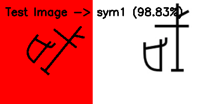

# Symbol Identification

Simple symbol classifier using OpenCV feature extraction and a classical ML model (RandomForest / KNN).

## Usage
```bash
python sym_classifier.py
````

Training images are expected in the `dataset/` directory.
The trained model is saved as `sym_model.pkl`.

## Results



